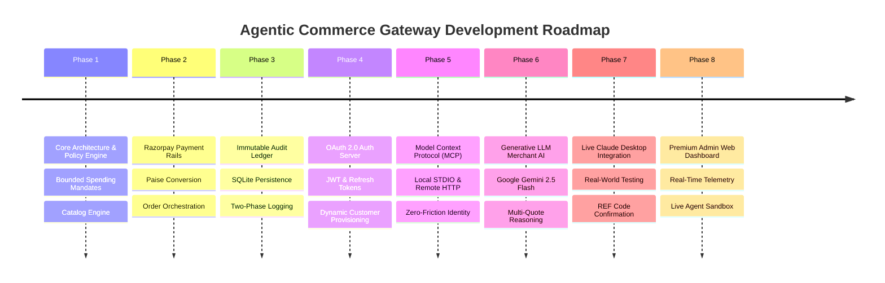
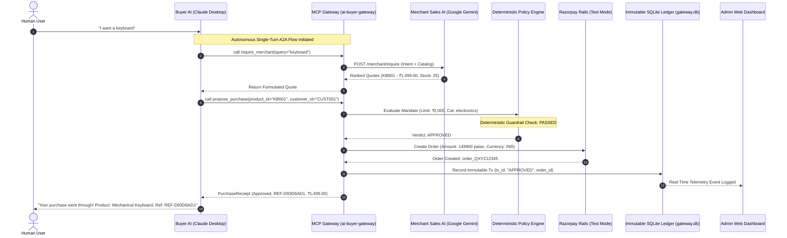

# 🌐 Agentic Commerce Gateway: Complete Engineering Journey & Architecture Report

> **A Comprehensive Reference Document on Building an Autonomous Agent-to-Agent (A2A) Bounded Commerce Pipeline with Deterministic Policy Guardrails, Google Gemini Merchant Intelligence, Razorpay Rails, and Real-Time Admin Telemetry.**

---

## 📑 Executive Summary

Traditional e-commerce architectures assume a human browsing a storefront, adding items to a cart, entering checkout credentials, and completing payment steps manually. As Large Language Models (LLMs) transition from conversational interfaces to autonomous execution engines, this paradigm fundamentally shifts: **AI Agents can now autonomously discover, negotiate, and execute purchases on behalf of users.**

However, granting autonomous AI agents direct access to credit cards or unconstrained payment APIs introduces severe financial and security risks:
- **Prompt Injection & Overspending**: An agent might hallucinate or be misled into buying ₹50,000 items instead of budget items.
- **Privacy Leakage**: Exposing merchant databases, private inventory costs, or API keys directly to client-side agents compromises system boundaries.
- **Audit Deficits**: AI reasoning is probabilistic and non-deterministic; financial transactions require deterministic, mathematically verifiable audit trails.

The **Agentic Commerce Gateway** solves this by establishing a **Zero-Trust, Bounded Agent-to-Agent (A2A) Commerce Infrastructure**:
1. **Buyer AI (e.g., Claude Desktop)** acts as the user's shopping delegate.
2. **Merchant AI (powered by Google Gemini 2.5 Flash)** acts as the store's autonomous sales engineer, reasoning over private inventory.
3. **Deterministic Policy Engine** enforces strict spending mandates (budget limits, merchant whitelists, product categories, and expiration dates) with mathematical certainty.
4. **Razorpay Payment Rails** execute valid transactions in test mode, minting real order IDs and human-readable reference codes (`REF-XXXXXXXX`).
5. **Immutable SQLite Audit Ledger** records every attempt, verdict, and payment receipt.
6. **Real-Time Admin Web Dashboard** provides live telemetry, mandate management, and interactive sandbox simulation.

---

## 🧭 The Development Journey: From Scratch to Full Realization



### Phase 1: Core Foundation & Deterministic Policy Guardrails
- **Goal**: Create the policy engine that rejects any purchase outside user-defined boundaries before any payment is initiated.
- **Implementation**: Formulated immutable `Mandate` schemas specifying max amount limits, allowed categories (`electronics`, `food`, etc.), allowed merchants, and expiry timestamps.
- **Rule Hierarchy**: Implemented deterministic evaluation rules: Customer Existence ➔ Mandate Expiry ➔ Merchant Whitelist ➔ Category Whitelist ➔ Spending Amount Limit.

### Phase 2: Payment Rails & Catalog Ingestion
- **Goal**: Integrate Razorpay payment rails and product catalog.
- **Implementation**: Wrapped Razorpay REST APIs with graceful offline fallbacks for automated testing. Handled currency precision (converting INR ₹ to sub-unit Paise) and error isolation.

### Phase 3: Immutable Audit Ledger & Two-Phase Recording
- **Goal**: Ensure non-repudiation and complete financial observability.
- **Implementation**: Built `AuditStore` backed by SQLite (`gateway.db`). Every attempt is logged with timestamp, unique `transaction_id` (UUID4), policy verdict (`APPROVED` / `REJECTED`), failure reason, and Razorpay order ID.

### Phase 4: Dynamic Customer Provisioning & OAuth 2.0 Engine
- **Goal**: Move from hardcoded demo users to enterprise identity management.
- **Implementation**: Built a complete RFC 6749 / RFC 7636 OAuth 2.0 Authorization Server with PBKDF2 password hashing, RS256/HS256 JWT access tokens, token refresh rotation, and admin provisioning APIs.

### Phase 5: Model Context Protocol (MCP) Server
- **Goal**: Expose the gateway tools to AI models like Claude Desktop.
- **Implementation**: Built dual MCP transport support:
  - **Local STDIO Server** (`python -m app.mcp.server`) for native desktop clients.
  - **Remote Streamable HTTP MCP Server** (`POST /mcp`) with bearer token authentication for cloud agents.

### Phase 6: Merchant-Side Generative AI Agent (A2A Architecture)
- **Goal**: Replace simple keyword lookup with a real Generative LLM Merchant Sales Agent.
- **Implementation**: Integrated **Google Gemini (`gemini-2.5-flash`)** to analyze user intent, reason over catalog items, evaluate stock and budget constraints, and formulate structured, transparent quotes.

### Phase 7: Live Real-World Claude Desktop Testing
- **Goal**: Validate end-to-end zero-friction agent-to-agent procurement.
- **Execution**: User enabled the `ai-buyer-gateway` connector in Claude Desktop, typed *"buy the keyboard"*, Claude consulted the Gemini Merchant Agent, evaluated the ₹2,000 mandate, and successfully returned reference code `REF-D93D6AD1` with zero human intervention.

### Phase 8: Premium Admin Web Dashboard
- **Goal**: Provide operations teams with full visibility and control.
- **Implementation**: Built a dark glassmorphic Single Page App (`http://127.0.0.1:8000/admin/dashboard`) with real-time KPI metrics, audit trail inspector, live mandate limit updater, store inventory browser, and dual-agent test sandbox.

---

## 🛠️ Technology Stack & Tools Used

| Layer | Technologies / Libraries | Purpose |
| :--- | :--- | :--- |
| **Backend Framework** | `FastAPI`, `Uvicorn`, `Starlette` | High-performance asynchronous REST API & Static server |
| **Agent Protocols** | `mcp` (Model Context Protocol SDK), `JSON-RPC 2.0` | Standardized AI agent tool execution across Claude / IDEs |
| **Generative AI** | `Google Gemini 2.5 Flash`, Google Generative Language API | Merchant-side generative sales reasoning & quote ranking |
| **Payment Gateway** | `Razorpay Python SDK`, REST APIs | Test-mode payment order generation & verification |
| **Security & Auth** | `PyJWT`, `passlib` (PBKDF2 SHA-256), `cryptography` | OAuth2 Authorization Server, Bearer JWTs, and API keys |
| **Persistence** | `SQLite3` (`gateway.db`), `Pydantic v2` | Immutable write-ahead audit ledger & typed schema validation |
| **Testing Suite** | `pytest`, `pytest-asyncio`, `httpx` | 150 automated unit, integration, and security tests |
| **Admin UI** | Vanilla HTML5, Modern Glassmorphic CSS, Native JS | Responsive operations dashboard, telemetry & live sandbox |

---

## 🧩 Comprehensive System Architecture



---

## 🧰 Tools & Endpoints Developed

### 1. Model Context Protocol (MCP) Tools
Exposed directly to AI agents via `python -m app.mcp.server` and remote HTTP `/mcp`:
- **`inquire_merchant(query, max_budget, category, quantity)`**: Sends natural language buyer inquiries to the Gemini Merchant Agent to receive structured product quotes without revealing the private database.
- **`propose_purchase(product_id, quantity, customer_id, idempotency_key)`**: Submits a purchase proposal to the Policy Engine for deterministic evaluation and Razorpay order creation.
- **`search_products(query, category, max_price)`**: Keyword-based catalog search tool.
- **`resolve_customer(query)`**: Discovers customer profile IDs from human names or email addresses.

### 2. REST API Endpoints
- **Catalog**: `GET /products`, `GET /products/{id}`
- **Agent Purchasing**: `POST /agent/purchase`
- **Merchant Intelligence**: `POST /merchant/inquire`
- **Audit Ledger**: `GET /audit`, `GET /audit/{tx_id}`
- **Admin Management**: `GET /admin/customers`, `POST /admin/customers`, `PATCH /admin/customers/{id}/mandate`
- **OAuth 2.0**: `GET /oauth/authorize`, `POST /oauth/authorize`, `POST /oauth/token`, `GET /.well-known/oauth-authorization-server`
- **Dashboard UI**: `GET /admin/dashboard`, `GET /admin`

---

## ⚠️ Challenges Faced & Technical Solutions

During development, we solved multiple complex architectural challenges:

### 1. Single-Agent vs. True Agent-to-Agent (A2A) Commerce
- **Problem**: In standard MCP setups, Claude would do all reasoning, pricing, and database lookups directly. This meant the client-side agent had full access to backend data with no merchant representation.
- **Solution**: Built a distinct **Merchant Sales AI Agent** powered by **Google Gemini 2.5 Flash**. Claude acts purely as the Buyer's negotiator, while Gemini represents the Store. Gemini reasons over catalog features, stock availability, and margins, returning clean, transparent quotes.

### 2. Zero-Friction Local Identity Management
- **Problem**: Claude Desktop was asking users: *"What is your name, email, and Customer ID?"* on every shopping prompt.
- **Solution**: Implemented zero-friction smart defaults (`CUST001` - Dinesh Kumar) for local STDIO connector calls, while retaining strict OAuth Bearer token resolution for remote HTTP calls. Updated tool descriptions to command single-turn execution.

### 3. Claude Desktop Web Search Preemption
- **Problem**: When users typed *"i want keyboard"*, Claude occasionally ran a public Google search on the web instead of using the local store connector.
- **Solution**: Updated system prompts and tool docstrings with explicit high-priority instructions: *"When the user expresses shopping intent, immediately invoke `inquire_merchant` to search our inventory before consulting external web sources."*

### 4. Currency Precision & Razorpay Paise Conversion
- **Problem**: Passing standard floating-point INR (e.g. ₹1,499.00) directly to payment APIs causes rounding errors and invalid format rejections.
- **Solution**: Implemented strict currency conversion converting all Rupee values to integer Paise (`int(round(amount * 100))`) with complete test coverage.

### 5. Multi-Token Keyword & Description Search
- **Problem**: Searching for *"clicky keyboard"* failed to match product `"Mechanical Gaming Keyboard"` because the keyword was inside the product description ("tactile blue switches with clicky feedback").
- **Solution**: Upgraded catalog search to tokenize multi-word queries and search across both title and deep text descriptions.

### 6. Admin Dashboard Null-Safety & Quiet Polling
- **Problem**: Earlier test transactions in SQLite had null fields, which threw JavaScript runtime errors and blanked the catalog/mandate tables. Additionally, 5-second polling flooded terminal logs.
- **Solution**: Added complete null-safety guards across all UI rendering functions (`(Number(r.amount) || 0)`) and replaced automatic terminal flooding with a quiet manual **"Refresh Data"** button and optional live sync switch.

---

## 📖 End-to-End System Operating Guide

### Step 1: Starting the Gateway
Run the unified FastAPI server in your virtual environment:
```powershell
.\.venv\Scripts\Activate.ps1
uvicorn app.main:app --reload --host 127.0.0.1 --port 8000
```

### Step 2: Accessing the Admin Dashboard
Open your browser to:
👉 **`http://127.0.0.1:8000/admin`**

- **Overview Tab**: View live spending totals, approval rates, and recent transaction stream.
- **Audit Trail Tab**: Search and filter all purchase proposals, inspect Razorpay order IDs.
- **Mandates Tab**: Adjust spending limits in real-time or click **"+ Provision Customer"** to add new users.
- **Store Catalog Tab**: Inspect real-time product inventory and stock levels.
- **Agent Sandbox Tab**: Run interactive simulations of Buyer inquiries and Merchant AI quotes.

### Step 3: Transacting via Claude Desktop
1. Ensure your `claude_desktop_config.json` includes:
   ```json
   {
     "mcpServers": {
       "ai-buyer-gateway": {
         "command": "D:\\RazorPay\\.venv\\Scripts\\python.exe",
         "args": ["-m", "app.mcp.server"]
       }
     }
   }
   ```
2. Open Claude Desktop.
3. Toggle ON the **`ai-buyer-gateway`** connector.
4. Type any natural shopping request:
   > **`"Buy the mechanical keyboard"`**
5. Claude will query Gemini, verify the ₹2,000 mandate, and confirm your purchase with an immutable reference code!

---

## 🧪 Verification & Test Suite Health

The gateway includes an extensive automated test suite with **150 passed tests**:

```
============================== 150 passed in 69.18s ==============================
- tests/test_policy_engine.py  : 23 passed (Boundary limits, expiry, category whitelists)
- tests/test_payments.py       : 16 passed (Razorpay orders, paise conversion, receipts)
- tests/test_audit.py          : 12 passed (Immutable SQLite logging, SHA-256 integrity)
- tests/test_oauth.py          : 17 passed (JWT tokens, PBKDF2 hashing, refresh grants)
- tests/test_merchant_agent.py : 8 passed (Gemini LLM reasoning, quotes, A2A pipeline)
- tests/test_mcp.py            : 24 passed (Local STDIO tools, idempotency, resolution)
- tests/test_mcp_remote.py     : 8 passed (Streamable HTTP, auth headers, token isolation)
- tests/test_admin.py          : 10 passed (Mandate updates, customer provisioning)
- tests/test_dashboard.py      : 3 passed (HTML dashboard, static CSS/JS serving)
- tests/test_catalog.py        : 14 passed (Product filtering, multi-token search)
- tests/test_agent.py          : 15 passed (End-to-end purchasing orchestrator)
```

---

## 🎯 Conclusion & Future Horizons

The **Agentic Commerce Gateway** successfully establishes a production-grade blueprint for the future of AI-driven commerce. By combining **Generative LLM reasoning** on both the Buyer and Merchant sides with **Deterministic Policy Guardrails** and **Immutable Audit Trails**, it unlocks autonomous purchasing that is safe, fast, and mathematically verifiable.

### Recommended Next Horizons:
1. **Multi-Merchant Bidding**: Expand the Merchant Agent into an open network where multiple merchant agents submit competing real-time quotes to the Buyer AI.
2. **Dynamic Biometric Step-Up**: For transactions exceeding normal mandate limits (e.g. ₹10,000+), trigger instant push notification approvals to the user's mobile device.
3. **Webhook Settlement Automation**: Connect Razorpay webhook listeners to automatically update order fulfillment statuses in the SQLite audit ledger.
