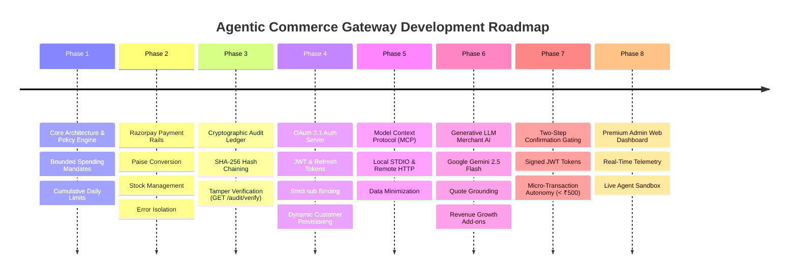
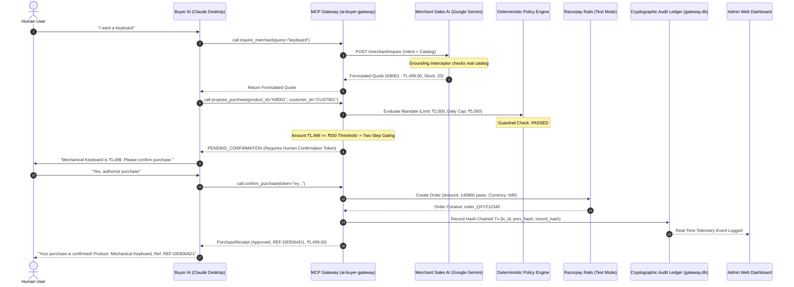

# 🌐 Agentic Commerce Gateway: Complete Engineering Journey & Architecture Report

> **A Comprehensive Reference Document on Building an Autonomous Agent-to-Agent (A2A) Bounded Commerce Pipeline with Deterministic Policy Guardrails, Google Gemini Merchant Intelligence, Two-Step Confirmation Gating, Cryptographic Audit Ledger, Razorpay Rails, and Real-Time Admin Telemetry.**

---

## 📑 Executive Summary

Traditional e-commerce architectures assume a human browsing a storefront, adding items to a cart, entering checkout credentials, and completing payment steps manually. As Large Language Models (LLMs) transition from conversational interfaces to autonomous execution engines, this paradigm fundamentally shifts: **AI Agents can now autonomously discover, negotiate, and execute purchases on behalf of users.**

However, granting autonomous AI agents direct access to credit cards or unconstrained payment APIs introduces severe financial and security risks:
- **Prompt Injection & Overspending**: An agent might hallucinate or be misled into buying ₹50,000 items instead of budget items.
- **Unconstrained Autonomy**: An AI agent should propose purchases, with high-value transactions gated behind explicit cryptographic human confirmation.
- **Privacy Leakage**: Exposing merchant databases, private inventory costs, or API keys directly to client-side agents compromises system boundaries.
- **Audit Deficits & Tampering**: Probabilistic AI outputs require an immutable, cryptographically verifiable audit trail.

The **Agentic Commerce Gateway** solves this by establishing a **Zero-Trust, Bounded Agent-to-Agent (A2A) Commerce Infrastructure**:
1. **Buyer AI (e.g., Claude Desktop)** acts as the user's shopping delegate.
2. **Merchant AI (powered by Google Gemini 2.5 Flash)** acts as the store's autonomous sales engineer, reasoning over private inventory with quote grounding interceptors.
3. **Deterministic Policy Engine** enforces strict spending mandates (single-transaction caps, cumulative daily limits, merchant whitelists, product categories, and expiration dates) with mathematical certainty.
4. **Two-Step Confirmation Gating**: Autonomous execution for micro-transactions ($< ₹500$), while transactions $\ge ₹500$ generate a short-lived, signed JWT confirmation token requiring human authorization before payment.
5. **Smart Revenue Growth (Add-ons & Cross-Sell)**: Suggests complementary catalog add-ons that fit precisely within the customer's remaining mandate budget headroom.
6. **Razorpay Payment Rails** execute valid transactions in test mode, minting real order IDs and human-readable reference codes (`REF-XXXXXXXX`).
7. **Cryptographic SHA-256 Hash-Chained Audit Ledger** records every attempt, verdict, and payment receipt into a tamper-evident chain with `GET /audit/verify`.
8. **Real-Time Admin Web Dashboard** provides live telemetry, mandate management, and interactive sandbox simulation.

---

## 🧭 The Development Journey: From Scratch to Full Realization



### Phase 1: Core Foundation & Deterministic Policy Guardrails
- **Goal**: Create the policy engine that rejects any purchase outside user-defined boundaries before any payment is initiated.
- **Implementation**: Formulated immutable `Mandate` schemas specifying max transaction limits, cumulative `daily_limit`, allowed categories (`electronics`, `food`, etc.), allowed merchants, and expiry timestamps.
- **Rule Hierarchy**: Implemented deterministic evaluation rules: Customer Existence ➔ Mandate Expiry ➔ Merchant Whitelist ➔ Category Whitelist ➔ Single Transaction Limit ➔ Cumulative Daily Spending Limit.

### Phase 2: Payment Rails, Stock Management & Catalog Ingestion
- **Goal**: Integrate Razorpay payment rails and dynamic product catalog inventory.
- **Implementation**: Wrapped Razorpay REST APIs with graceful offline fallbacks for automated testing. Handled currency precision (converting INR ₹ to sub-unit Paise), inventory decrement/restoration, and isolated payment failure handling (`PAYMENT_FAILED` status).

### Phase 3: Cryptographic SHA-256 Hash-Chained Audit Ledger
- **Goal**: Ensure non-repudiation, ledger immutability, and complete financial observability.
- **Implementation**: Built `AuditStore` backed by SQLite (`gateway.db`). Every attempt is logged with timestamp, unique `transaction_id` (UUID4), policy verdict (`APPROVED` / `REJECTED`), failure reason, and Razorpay order ID. Each record computes a SHA-256 hash chaining `prev_hash` $\rightarrow$ `record_hash`. Exposes `GET /audit/verify` for instant tamper detection.

### Phase 4: Dynamic Customer Provisioning & OAuth 2.1 Engine
- **Goal**: Enterprise identity management with zero customer impersonation vulnerabilities.
- **Implementation**: Built an RFC 6749 / RFC 8414 OAuth 2.1 Authorization Server with PBKDF2 password hashing, RS256/HS256 JWT access tokens, token refresh rotation, and strict binding of the authenticated JWT `sub` claim to customer identity.

### Phase 5: Model Context Protocol (MCP) Server
- **Goal**: Expose gateway tools to AI models like Claude Desktop with strict data minimization.
- **Implementation**: Dual transport support:
  - **Local STDIO Server** (`python -m app.mcp.server`) for native desktop clients.
  - **Remote Streamable HTTP MCP Server** (`POST /mcp`) with bearer token authentication for cloud agents.
  - Preserves data minimization via `to_customer_response()` (hides internal UUIDs and Razorpay IDs from LLM prompts).

### Phase 6: Merchant-Side Generative AI Agent & Quote Grounding
- **Goal**: Real Generative LLM Merchant Sales Agent with revenue growth optimization.
- **Implementation**: Integrated **Google Gemini (`gemini-2.5-flash`)** to analyze user intent and formulate structured quotes. Built a strict **Quote Grounding Interceptor** that validates quotes against `PRODUCTS`, dropping hallucinated IDs and fixing incorrect prices/stocks. Added smart add-on recommendations (`POST /merchant/recommend-addons`, `suggest_addons`) to maximize merchant revenue within mandate headroom.

### Phase 7: Two-Step Confirmation Gating Architecture
- **Goal**: Comply with the safety principle: *"An AI agent may only ever propose a purchase, never authorize one."*
- **Implementation**:
  - Micro-transactions ($< ₹500$) auto-execute under mandate.
  - Transactions $\ge ₹500$ return `PENDING_CONFIRMATION` with a signed 5-minute JWT confirmation token.
  - Human authorization or `POST /agent/confirm` / `confirm_purchase` tool executes the order.

### Phase 8: Premium Admin Web Dashboard
- **Goal**: Operations visibility and live control.
- **Implementation**: Dark glassmorphic Single Page App (`http://127.0.0.1:8000/admin/dashboard`) with real-time KPI metrics, audit trail inspector, live mandate limit updater, store inventory browser, and dual-agent test sandbox.

---

## 🛠️ Technology Stack & Tools Used

| Layer | Technologies / Libraries | Purpose |
| :--- | :--- | :--- |
| **Backend Framework** | `FastAPI`, `Uvicorn`, `Starlette` | High-performance asynchronous REST API & Static server |
| **Agent Protocols** | `mcp` (Model Context Protocol SDK), `JSON-RPC 2.0` | Standardized AI agent tool execution across Claude / IDEs |
| **Generative AI** | `Google Gemini 2.5 Flash`, Google Generative Language API | Merchant-side generative sales reasoning, quote ranking & add-ons |
| **Payment Gateway** | `Razorpay Python SDK`, REST APIs | Test-mode payment order generation & verification |
| **Security & Auth** | `PyJWT>=2.8.0`, `passlib` (PBKDF2 SHA-256), `cryptography` | OAuth 2.1 Auth Server, Bearer JWTs, confirmation tokens & API keys |
| **Persistence** | `SQLite3` (`gateway.db`), `Pydantic v2` | Cryptographic hash-chained audit ledger & typed schema validation |
| **Testing Suite** | `pytest`, `pytest-asyncio`, `httpx` | 150 automated unit, integration, and security tests (100% passing) |
| **Admin UI** | Vanilla HTML5, Modern Glassmorphic CSS, Native JS | Operations dashboard, audit ledger verification & live sandbox |

---

## 🧩 Comprehensive System Architecture



---

## 🧰 Tools & Endpoints Developed

### 1. Model Context Protocol (MCP) Tools
Exposed directly to AI agents via `python -m app.mcp.server` and remote HTTP `/mcp`:
- **`inquire_merchant(query, max_budget, category, quantity)`**: Sends natural language buyer inquiries to the Gemini Merchant Agent to receive structured product quotes without revealing the private database.
- **`suggest_addons(product_id, remaining_budget)`**: Discovers complementary cross-sell add-ons that fit within the customer's remaining mandate budget headroom.
- **`propose_purchase(product_id, quantity, customer_id, idempotency_key)`**: Submits a purchase proposal to the Policy Engine for deterministic evaluation. Returns `PENDING_CONFIRMATION` for $\ge ₹500$ or auto-executes for $< ₹500$.
- **`confirm_purchase(confirmation_token, customer_id)`**: Authorizes and settles a pending purchase proposal using a signed confirmation token.
- **`search_products(query, category, max_price)`**: Keyword-based catalog search tool.
- **`resolve_customer(query)`**: Discovers customer profile IDs from human names or email addresses.

### 2. REST API Endpoints
- **Catalog**: `GET /products`, `GET /products/{id}`
- **Agent Purchasing**: `POST /agent/purchase` (Auth Protected), `POST /agent/confirm` (Auth Protected)
- **Merchant Intelligence**: `POST /merchant/inquire`, `POST /merchant/recommend-addons`
- **Audit Ledger**: `GET /audit`, `GET /audit/{tx_id}`, `GET /audit/verify` (Cryptographic integrity check)
- **Admin Management**: `GET /admin/customers`, `POST /admin/customers`, `PATCH /admin/customers/{id}/mandate`
- **OAuth 2.1**: `GET /oauth/authorize`, `POST /oauth/authorize`, `POST /oauth/token`, `GET /.well-known/oauth-authorization-server`, `GET /.well-known/oauth-protected-resource`
- **Dashboard UI**: `GET /admin/dashboard`, `GET /admin`

---

## 🧪 Verification & Test Suite Health

The gateway includes an extensive automated test suite with **150 passed tests (100% pass rate)**:

```
============================== 150 passed in 85.38s ==============================
- tests/test_policy_engine.py          : 23 passed (Boundary limits, expiry, category whitelists, daily caps)
- tests/test_payments.py               : 16 passed (Razorpay orders, paise conversion, receipts, error isolation)
- tests/test_audit.py                  : 12 passed (Immutable SQLite logging, SHA-256 hash chaining, verify)
- tests/test_oauth.py                  : 17 passed (JWT tokens, PBKDF2 hashing, refresh grants, sub claims)
- tests/test_merchant_agent.py         : 11 passed (Gemini LLM reasoning, quote grounding, add-on recommendations)
- tests/test_mcp.py                    : 24 passed (Local STDIO tools, confirmation gating, idempotency)
- tests/test_mcp_remote.py             : 8 passed  (Streamable HTTP, auth headers, token isolation)
- tests/test_agent_router.py           : 14 passed (Auth-protected purchasing, confirmation tokens, error mapping)
- tests/test_admin.py                  : 10 passed (Mandate updates, customer provisioning, admin security)
- tests/test_dashboard.py              : 3 passed  (HTML dashboard, static CSS/JS serving)
- tests/test_catalog.py                : 10 passed (Product filtering, multi-token search, stock management)
- tests/test_google_oauth_and_signup.py: 2 passed  (Google login redirect & auto-provisioning)
```

---

## 🎯 Conclusion & Track 01 Alignment

The **Agentic Commerce Gateway** delivers the complete Track 01 specification for **Agent-to-Agent Commerce**:
1. **Safety & Human Restraint**: An AI agent may only ever propose purchases; high-value purchases are gated behind short-lived cryptographic confirmation tokens.
2. **Revenue Growth**: Smart Gemini add-on recommendations maximize basket size within mandate headroom.
3. **Deterministic Governance**: Multi-tier policy limits (per-transaction, cumulative daily, categories, merchants, expiry) protect against overspending.
4. **Verifiable Auditability**: SHA-256 cryptographic hash-chained ledger ensures tamper-evident financial compliance.
