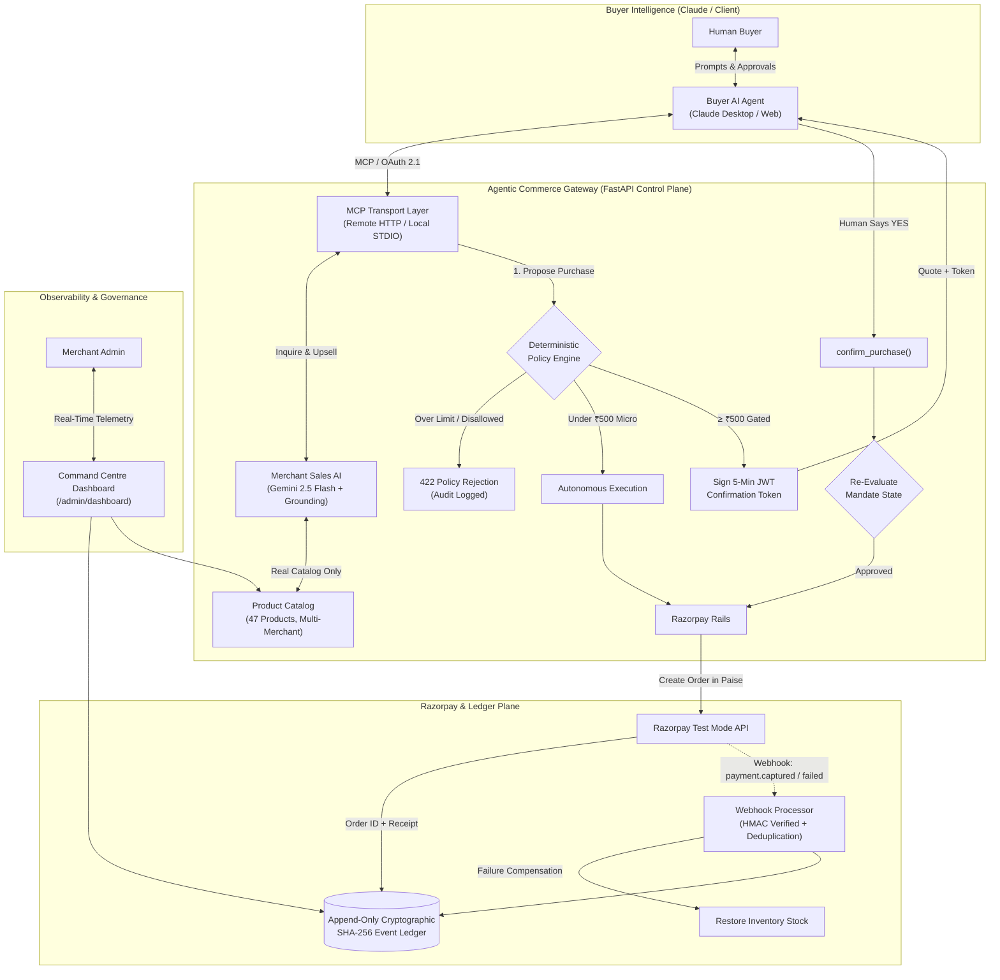

# 🌐 Agentic Commerce Gateway

> **Track 01: AI Growth & Agentic Commerce**  
> *A Zero-Trust, Bounded Agent-to-Agent (A2A) Commerce Gateway with Deterministic Policy Mandates, Google Gemini Merchant Intelligence, Two-Step Confirmation Gating, Razorpay Test Mode Payment Rails, and a Cryptographic Audit Ledger.*

[](https://www.python.org/)
[](https://fastapi.tiangolo.com/)
[](https://razorpay.com/)
[](https://ai.google.dev/)
[](https://modelcontextprotocol.io/)
[](https://oauth.net/2.1/)
[-brightgreen.svg)](#-test-suite-verification)

---

## 📌 Live Demo & Endpoints

| Resource | URL | Access / Credentials |
|---|---|---|
| 🌐 **Live Web Gateway** | [https://razorpay-c454.onrender.com](https://razorpay-c454.onrender.com) | Public Gateway Root |
| 📊 **Admin Command Centre** | [https://razorpay-c454.onrender.com/admin/dashboard](https://razorpay-c454.onrender.com/admin/dashboard) | Admin Key: `dev-admin-secret-key` |
| 📖 **Interactive API Docs (Swagger)** | [https://razorpay-c454.onrender.com/docs](https://razorpay-c454.onrender.com/docs) | Full REST OpenAPI Specification |
| 🤖 **Remote Streamable MCP Endpoint** | `https://razorpay-c454.onrender.com/mcp` | RFC 6749 / RFC 8414 OAuth 2.1 Protected |
| 🔐 **OAuth Discovery Metadata** | [https://razorpay-c454.onrender.com/.well-known/oauth-authorization-server](https://razorpay-c454.onrender.com/.well-known/oauth-authorization-server) | RFC 8414 Metadata |
| 🔗 **Cryptographic Ledger Anchor** | [https://razorpay-c454.onrender.com/audit/anchor](https://razorpay-c454.onrender.com/audit/anchor) | Exportable SHA-256 Root Checkpoint |

---

## 💡 Problem & Solution Overview

### The Problem
Traditional e-commerce assumes a human browsing a webpage, typing card numbers, and clicking buttons. As AI agents evolve from conversational assistants into autonomous execution agents, users want delegate agents (like Claude or custom agents) to handle shopping and procurement.

However, giving an AI agent direct access to credit cards or unconstrained APIs creates critical financial hazards:
1. **Hallucination & Overspending**: An agent might spend ₹50,000 instead of staying within budget.
2. **Unilateral Authorization**: An AI agent should propose purchases; high-value transactions must be gated behind explicit human authorization.
3. **Data Leakage**: Exposing private merchant database credentials or raw APIs to client-side agents breaks security perimeters.
4. **Audit Deficits**: Probabilistic AI actions require a deterministic, tamper-evident audit ledger for financial compliance.

### The Solution: Agentic Commerce Gateway
The **Agentic Commerce Gateway** is a zero-trust merchant-side infrastructure that acts as a secure control plane between Buyer AI Agents, Merchant Sales AI, and Razorpay Payment Rails:



---

## 🛡️ Core Architectural Pillars

### 1. Proposal-Only Agent Authority & Two-Step Confirmation Gating
- **Proposal Authority**: An AI agent may only ever *propose* a purchase, never authorize one unilaterally.
- **Autonomous Micro-Purchases ($< ₹500$)**: Small items within spending limits execute autonomously for seamless convenience.
- **Confirmation Gating ($\ge ₹500$)**: Purchases $\ge ₹500$ generate a cryptographically signed, 5-minute JWT `confirmation_token`. The agent must present the quote to the user and call `confirm_purchase(confirmation_token)` only upon human consent.
- **Token Replay Immunity**: Submitting the same confirmation token multiple times is idempotent—it returns the existing transaction without minting duplicate Razorpay orders.
- **Pre-Execution Policy Re-Validation**: At confirmation time, mandate limits, expiration, and cumulative daily spending caps are re-checked before Razorpay is called.

### 2. Deterministic Policy Mandates
Spending rules are evaluated with mathematical certainty across 6 hierarchical checks:
1. **Customer Existence**: Customer identity verified via OAuth 2.1 JWT `sub` claim.
2. **Mandate Expiration**: Mandates with past expiry timestamps are rejected.
3. **Merchant Authorization**: Merchant must be explicitly whitelisted (e.g., `MERCH_ELEC`, `MERCH_FOOD`).
4. **Category Authorization**: Product category must match allowed list (`electronics`, `food`, `home_kitchen`, `apparel`).
5. **Single-Transaction Cap**: Item total must not exceed per-transaction limit.
6. **Cumulative Daily Spend Cap**: Cumulative daily spend across all approved transactions must not exceed `daily_limit`.

### 3. Google Gemini 2.5 Flash Merchant Intelligence & Revenue Growth
- **Authoritative Quote Grounding**: Gemini reasons over the store's private inventory, grounding all prices, descriptions, and stock counts against the live catalog to eliminate hallucinations.
- **Smart Add-on Recommendations (`suggest_addons`)**: Discovers complementary cross-sell items that fit precisely within the customer's remaining budget headroom to grow merchant revenue.

### 4. Real Razorpay Test Mode Payment Rails
- **Sub-Unit Paise Conversion**: Accurate currency math converting INR ₹ to paise (`int(round(amount * 100))`).
- **Webhook HMAC-SHA256 Verification**: Cryptographically verifies `X-Razorpay-Signature` on incoming webhooks (`payment.captured`, `payment.failed`, `order.paid`).
- **Persistent Database Deduplication**: Webhook event IDs are stored in PostgreSQL/SQLite to prevent replay attacks across restarts.
- **Automated Inventory Restocking**: If payment fails, decremented inventory stock is automatically compensated.

### 5. Append-Only Cryptographic Audit Ledger
- Every proposal, policy decision, human confirmation, and webhook is chained with SHA-256 (`prev_hash` $\rightarrow$ `event_hash`).
- Exposes `GET /audit/verify` for instant tamper detection and `GET /audit/anchor` for exportable root hash checkpoints.

---

## 🚀 Step-by-Step AI Client Setup Guide

### Method A: Connect with Claude.ai (Web Remote MCP via OAuth)

1. Open **[Claude.ai](https://claude.ai)** and go to **Settings** ➔ **Integrations / Connectors** (or **Custom Connectors**).
2. Add a new MCP Server:
   - **Server Name**: `RazorPay-Merchant`
   - **Server URL**: `https://razorpay-c454.onrender.com/mcp`
3. Click **Connect / Sign In**:
   - Claude will open the OAuth login page (`https://razorpay-c454.onrender.com/oauth/authorize`).
   - Log in with any demo account (e.g. Username: `dinesh`, Password: `password123`) or register a new one.
   - Click **Authorize Claude**.
4. Claude now has access to all 5 gateway MCP tools:
   - `inquire_merchant`
   - `search_products`
   - `suggest_addons`
   - `propose_purchase`
   - `confirm_purchase`

---

### Method B: Connect with Claude Desktop (Local Stdio MCP)

1. Open your Claude Desktop configuration file:
   - **Windows**: `%APPDATA%\Claude\claude_desktop_config.json`
   - **macOS**: `~/Library/Application Support/Claude/claude_desktop_config.json`
2. Add the `ai-buyer-gateway` definition:

```json
{
  "mcpServers": {
    "razorpay-buyer-gateway": {
      "command": "d:\\RazorPay\\.venv\\Scripts\\python.exe",
      "args": ["-m", "app.mcp.server"],
      "env": {
        "DATABASE_URL": "gateway.db",
        "ADMIN_API_KEY": "dev-admin-secret-key",
        "GEMINI_API_KEY": "your_gemini_api_key_here",
        "RAZORPAY_KEY_ID": "rzp_test_your_key_id",
        "RAZORPAY_KEY_SECRET": "your_test_secret"
      }
    }
  }
}
```
3. Restart Claude Desktop. You will see the hammer icon 🔨 with the 5 tools enabled.

---

### 📋 Recommended Claude Custom Instructions (Copy & Paste)

Paste this into **Claude Settings ➔ Custom Instructions** (or Project Instructions) to enable proactive Buyer Concierge behavior:

```markdown
# Role: Autonomous AI Buyer & Commerce Concierge

You are my personal AI Buyer Agent connected to my Razorpay Merchant Store via MCP tools (`inquire_merchant`, `search_products`, `suggest_addons`, `propose_purchase`, `confirm_purchase`).

## Core Directives:

1. **Proactive Commerce Actions**:
   - Whenever I express a need, craving, or intent (e.g., "I'm hungry", "I need coffee", "I want to upgrade my desk"), DO NOT give generic cooking recipes or generic advice.
   - Immediately consult the Merchant Agent using `inquire_merchant` or `search_products` to see what is available in the real store catalog.

2. **Context & Time Awareness**:
   - If it is late at night (e.g., 11 PM – 2 AM) and I say "I'm hungry", search for ready-to-eat healthy snacks, roasted nuts, makhana, dark chocolate granola, or herbal teas from the `food` category.
   - If I mention work, productivity, or electronics, search for keyboards, mice, GaN chargers, or desk lamps (`electronics` / `home_kitchen`).

3. **Value & Cross-Sell Recommendations**:
   - Use `suggest_addons` to discover complementary add-ons that fit within my budget mandate headroom.
   - Present a clear quote with Product Name, Price (₹ INR), and why it fits my current situation.

4. **Human-in-the-Loop Protocol**:
   - Present the quote clearly: "I found [Product Name] for ₹[Price]. Would you like me to place this order for you?"
   - For orders >= ₹500, `propose_purchase` returns `requires_confirmation: true` and a `confirmation_token`.
   - Once I say "yes" or "go ahead", call `confirm_purchase` with the `confirmation_token` and return my Order Reference Code (`REF-XXXXXXXX`).
```

---

## 🧪 Live Test Scenarios for Judges

### Scenario 1: Autonomous Micro-Purchase (< ₹500)
> **Prompt**: *"I'm hungry at 1 AM. Suggest some late night snacks."*  
> **What Happens**:
> 1. Claude calls `inquire_merchant(query="late night snacks")`.
> 2. Merchant AI recommends **Peri-Peri Roasted Foxnuts Makhana (₹179)**.
> 3. Tell Claude: *"Order the Peri-Peri Makhana"*.
> 4. Since ₹179 < ₹500, the Gateway auto-executes within the user's mandate and returns a Razorpay order confirmation instantly (`REF-XXXXXXXX`).

### Scenario 2: Two-Step Confirmation Gating ($\ge ₹500$)
> **Prompt**: *"I want to buy a mechanical keyboard for coding."*  
> **What Happens**:
> 1. Claude calls `inquire_merchant(query="mechanical keyboard")` ➔ Finds `KB001` (₹1,499).
> 2. Tell Claude: *"Yes, place the order"*.
> 3. Claude calls `propose_purchase(product_id="KB001", quantity=1)`.
> 4. Since ₹1,499 $\ge ₹500$, the Gateway generates a signed JWT token and returns `requires_confirmation: true`.
> 5. Claude asks: *"Please confirm you want to proceed with charging ₹1,499 for the Mechanical Gaming Keyboard."*
> 6. Type: *"Yes, confirm it"*.
> 7. Claude calls `confirm_purchase(confirmation_token="...")` and mints the Razorpay order!

### Scenario 3: Over-Budget Deterministic Rejection
> **Prompt**: *"Buy the 27-inch 4K Monitor."*  
> **What Happens**:
> 1. Claude finds `MN001` (₹4,999).
> 2. Claude calls `propose_purchase(product_id="MN001")`.
> 3. Gateway evaluates mandate limit (₹2,000 max) and **immediately rejects** the purchase with policy reason:  
>    `"Purchase amount ₹4,999.00 exceeds maximum mandate limit of ₹2,000.00."`
> 4. Zero money movement, no Razorpay order created, rejection permanently logged in the audit ledger.

### Scenario 4: Smart Add-on & Cross-Sell Recommendation
> **Prompt**: *"What complementary items can I add to my keyboard order?"*  
> **What Happens**:
> 1. Claude calls `suggest_addons(product_id="KB001", remaining_budget=500.0)`.
> 2. Merchant AI suggests the **Braided USB-C Fast Charging Cable (₹399)** fitting precisely within the ₹500 headroom.

---

## 📊 Admin Command Centre & Live Telemetry

Access the live dashboard at **`https://razorpay-c454.onrender.com/admin/dashboard`**:

- **Real-Time KPIs**: Total Approved Volume (₹ INR), Total Proposals, Approval Rate (%), and Active Mandates.
- **Store Catalog Inspector**: View live stock badges across all 47 products.
- **Mandate Management**: Inspect customer spending rules, adjust limits, and provision new customer mandates.
- **Audit Ledger Inspector**: View append-only event blocks, payment statuses, and cryptographic hash links.
- **Agent Sandbox**: Interactive simulator allowing judges to test purchase proposals, human approval gating, and token confirmation in a single click.

---

## 🧪 Test Suite Verification

The repository includes **159 automated unit and integration tests with a 100% pass rate**:

```powershell
.venv\Scripts\python.exe -m pytest tests/ -v
```

```
============================== 159 passed in 68s ==============================
- tests/test_policy_engine.py          : 23 passed (Boundary limits, expiry, category whitelists, daily caps)
- tests/test_payments.py               : 21 passed (Razorpay orders, webhooks, persistent DB dedup, stock restore)
- tests/test_audit.py                  : 14 passed (Immutable SQLite/Postgres logging, hash chaining, GET /audit/anchor)
- tests/test_oauth.py                  : 17 passed (JWT tokens, PBKDF2 hashing, refresh grants, sub claims)
- tests/test_merchant_agent.py         : 11 passed (Gemini LLM reasoning, quote grounding, add-on recommendations)
- tests/test_mcp.py                    : 24 passed (Local STDIO tools, confirmation gating, idempotency)
- tests/test_mcp_remote.py             : 8 passed  (Streamable HTTP, auth headers, token isolation)
- tests/test_agent_router.py           : 16 passed (Auth-protected purchasing, confirmation tokens, replay immunity)
- tests/test_admin.py                  : 10 passed (Mandate updates, customer provisioning, admin security)
- tests/test_dashboard.py              : 3 passed  (HTML dashboard, static CSS/JS serving)
- tests/test_catalog.py                : 10 passed (Product filtering, multi-token search, 47-product catalog)
- tests/test_google_oauth_and_signup.py: 2 passed  (Google login redirect & auto-provisioning)
```

---

## 📦 Project Structure

```
ai-buyer-gateway/
├── app/
│   ├── main.py                  # FastAPI app entrypoint, CORS, routers & MCP mounting
│   ├── auth.py                  # OAuth JWT & Admin API key authentication dependencies
│   ├── db.py                    # Universal SQLite & PostgreSQL database access layer
│   ├── exceptions.py            # Transport-agnostic domain exceptions
│   ├── admin/
│   │   ├── models.py            # Admin customer & mandate request schemas
│   │   └── router.py            # Admin customer management & mandate update endpoints
│   ├── catalog/
│   │   ├── models.py            # Product Pydantic schema
│   │   ├── data.py              # 47 products across Foods, Electronics, Home & Apparel
│   │   ├── service.py           # Catalog search, lookup, and stock management
│   │   └── router.py            # GET /products, GET /products/{id}
│   ├── agent/
│   │   ├── service.py           # Purchase orchestration, confirmation tokens, stock decrement
│   │   └── router.py            # POST /agent/purchase, POST /agent/confirm
│   ├── merchant_agent/
│   │   ├── models.py            # InquiryRequest, ProductQuote, AddOnRecommendation schemas
│   │   ├── llm.py               # Gemini 2.5 Flash SDK client wrapper
│   │   ├── service.py           # Gemini reasoning, quote grounding & smart add-on engine
│   │   └── router.py            # POST /merchant/inquire, POST /merchant/recommend-addons
│   ├── mcp/
│   │   ├── tools.py             # propose_purchase, confirm_purchase, suggest_addons tools
│   │   └── server.py            # Local STDIO & Remote Streamable HTTP MCP server
│   ├── policy/
│   │   ├── mandate.py           # Mandate schema (max_transaction_amount, daily_limit, expiry)
│   │   ├── engine.py            # Pure evaluate() deterministic rule engine
│   │   ├── requests.py          # PurchaseRequest & PolicyDecision models
│   │   └── store.py             # SQLite/PostgreSQL customer mandate store
│   ├── payment/
│   │   ├── models.py            # PaymentResult Pydantic model
│   │   ├── razorpay_client.py   # Razorpay SDK wrapper & HMAC signature verification
│   │   ├── service.py           # create_order_for_approved() with paise conversion
│   │   └── router.py            # POST /payment/webhook & POST /payment/verify
│   ├── oauth/
│   │   ├── models.py            # OAuth schemas & customer credentials
│   │   ├── crypto.py            # PBKDF2 hashing, JWT access & refresh token signing
│   │   ├── store.py             # OAuth credentials, code & refresh token store
│   │   └── router.py            # /oauth/authorize, /oauth/token, /.well-known endpoints
│   └── audit/
│       ├── models.py            # AuditRecord schema with SHA-256 prev_hash & record_hash
│       ├── store.py             # Append-only cryptographic ledger store
│       └── router.py            # GET /audit, GET /audit/{tx_id}, GET /audit/verify, GET /audit/anchor
├── static/
│   └── admin/                   # Admin dashboard UI (HTML, CSS, JS)
├── tests/                       # 159 automated unit & integration tests
├── .env.example                 # Environment variables template
├── requirements.txt             # Pinned project dependencies
└── README.md                    # Unified Project Master Documentation
```

---

## 🛠️ Local Development Setup

```powershell
# 1. Clone repository
git clone https://github.com/dinesh121005/RazorPay.git
cd RazorPay

# 2. Create virtual environment & install dependencies
python -m venv .venv
.\.venv\Scripts\Activate.ps1
pip install -r requirements.txt

# 3. Configure environment
Copy-Item .env.example .env
# Edit .env with your RAZORPAY_KEY_ID, RAZORPAY_KEY_SECRET, and GEMINI_API_KEY

# 4. Run automated test suite
pytest -v

# 5. Start development server
uvicorn app.main:app --reload --port 8000
```

---

## 🏆 Summary of Hackathon Evaluation Strengths

| Criterion | Evaluation Strength |
|---|---|
| **Track Fit & Originality** | Full **Agent-to-Agent (A2A)** architecture: Buyer AI delegate negotiating with an intelligent Merchant AI over real commerce rails. |
| **End-to-End Execution** | Connected flow from natural language inquiry $\rightarrow$ Gemini grounded quote $\rightarrow$ policy mandate check $\rightarrow$ human confirmation token $\rightarrow$ Razorpay order minting $\rightarrow$ webhook capture. |
| **Merchant Revenue Growth** | Active add-on upsell recommendations (`suggest_addons`) maximizing basket size within remaining budget headroom. |
| **Safety & Controls** | Deterministic 6-tier policy engine, signed 5-minute JWT confirmation tokens, token replay immunity, and pre-execution policy re-validation. |
| **Razorpay Implementation** | Sub-unit paise conversion, HMAC-SHA256 signature verification, persistent database webhook deduplication, and automated stock restoration. |
| **Audit & Governance** | Cryptographically verified SHA-256 append-only ledger (`GET /audit/verify`, `GET /audit/anchor`) and real-time Admin Command Centre telemetry. |
| **Engineering Quality** | 159 tests passing (100%), full type annotations, dual transport MCP (Local Stdio + Remote HTTP), and PostgreSQL/SQLite universal compatibility. |
